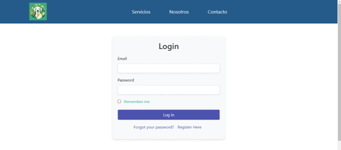
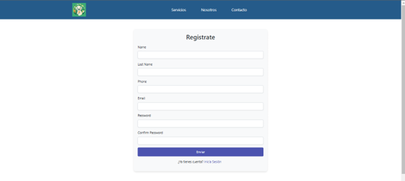
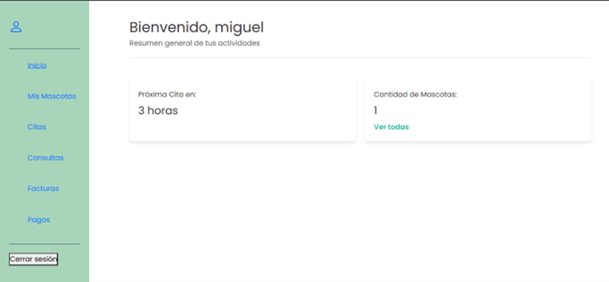
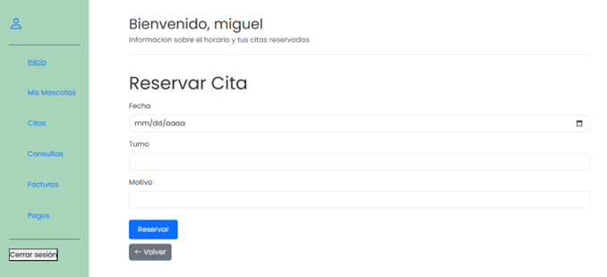
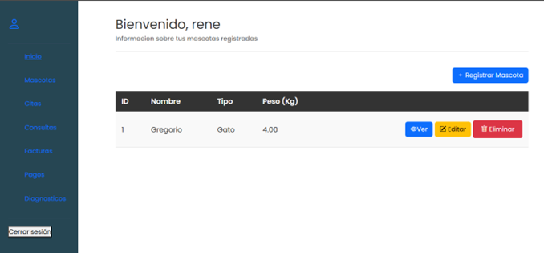
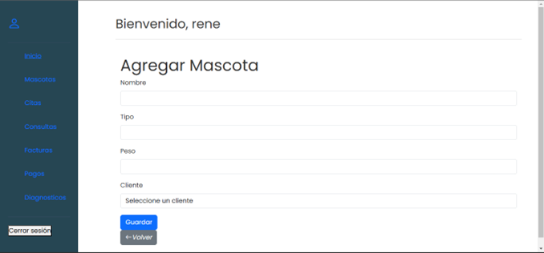

# MiVet App

**Sistema de gestión para una clínica veterinaria**, diseñado para facilitar el manejo de mascotas, citas, consultas médicas, facturación y pagos, así como la administración de usuarios y recursos. El proyecto busca mejorar la experiencia de los clientes, empleados y administradores mediante funcionalidades específicas para cada rol.

---

## 📌 Funcionalidades principales

### 👤 Usuario
- Visualizar la lista de sus mascotas.
- Registrar y visualizar citas.
- Visualizar la lista de sus consultas médicas.
- Visualizar la lista de sus facturas.
- Visualizar la lista de sus pagos.

### 🧑‍⚕️ Empleado
- Registrar, visualizar, editar y eliminar las mascotas de los usuarios.
- Visualizar y editar las citas asignadas.
- Registrar, visualizar y editar consultas médicas.
- Registrar, visualizar y editar facturas.
- Registrar, visualizar y editar pagos.
- Registrar, visualizar y editar diagnósticos.

---

## 🧭 Flujo del sistema

### 🌐 Visitante (no autenticado)

1. Al entrar a la aplicación, el visitante verá dos botones principales:
   - **Iniciar Sesión**
   - **Registrarse**
2. Según lo que elija, será redirigido al formulario correspondiente:
   - Login: solicita correo y contraseña.
   - Registro: solicita datos personales (nombre, apellido, etc).

📷 Ejemplo:




---

### 👤 Usuario autenticado

Una vez inicia sesión, el usuario accede a su dashboard con un menú lateral. Desde allí puede:

- **Mis Mascotas**: ver la lista de sus mascotas.
- **Citas**: ver historial de citas y registrar nuevas.
- **Consultas**: ver historial de consultas médicas.
- **Facturas**: ver historial de facturación.
- **Pagos**: ver historial de pagos.

📷 Ejemplo:




---

### 🧑‍⚕️ Empleado autenticado

El empleado accede a un dashboard más completo con funcionalidades adicionales:

- **Mascotas**:
  - Ver listado
  - Agregar, editar, eliminar
  - Ver detalles
- **Citas**: ver y editar las que le corresponden
- **Consultas**: ver y editar
- **Facturas**: registrar y editar
- **Pagos**: registrar y editar
- **Diagnósticos**: registrar y editar

📷 Ejemplo:




---

## ⚙️ Instalación del proyecto

Para ejecutar este proyecto localmente, seguí los siguientes pasos:

```bash
# Clonar el repositorio
git clone https://github.com/miguelhuarsaya17/mi-vet-app.git

# Ingresar al directorio del proyecto
cd mi-vet-app

# Instalar las dependencias
composer install

# Copiar el archivo de entorno
cp .env.example .env

# Generar la clave de aplicación
php artisan key:generate
```

1. Configurar la conexión a la base de datos en el archivo `.env`.
2. Crear una base de datos vacía con el nombre que pusiste en `.env`.
3. Ejecutar las migraciones (si están disponibles):

```bash
php artisan migrate
```

4. (Opcional) Ejecutar seeders si los tenés configurados.

5. Iniciar el servidor de desarrollo:

```bash
php artisan serve
```

El proyecto debería estar disponible en `http://localhost:8000`

> Asegurate de tener instalado:
> - PHP 8.x
> - Composer
> - MySQL o MariaDB
> - Laravel CLI

---

## 📂 Estructura de capturas

```
capturas/
├── visitante/
│   ├── login.png
│   ├── registro.png
├── usuario/
│   ├── dashboard.png
│   ├── registrar_cita.png
│   └── ...
├── empleado/
│   ├── mascotas.png
│   ├── formulario_mascota.png
│   └── ...
```

---

## 👨‍💻 Autor

Miguel Ángel Huarsaya Carranza  
Proyecto desarrollado como parte de la materia de Producción Web del Instituto Superior en Análisis de Sistemas.

---

## 📄 Licencia

Este proyecto está disponible para fines educativos y demostrativos.

